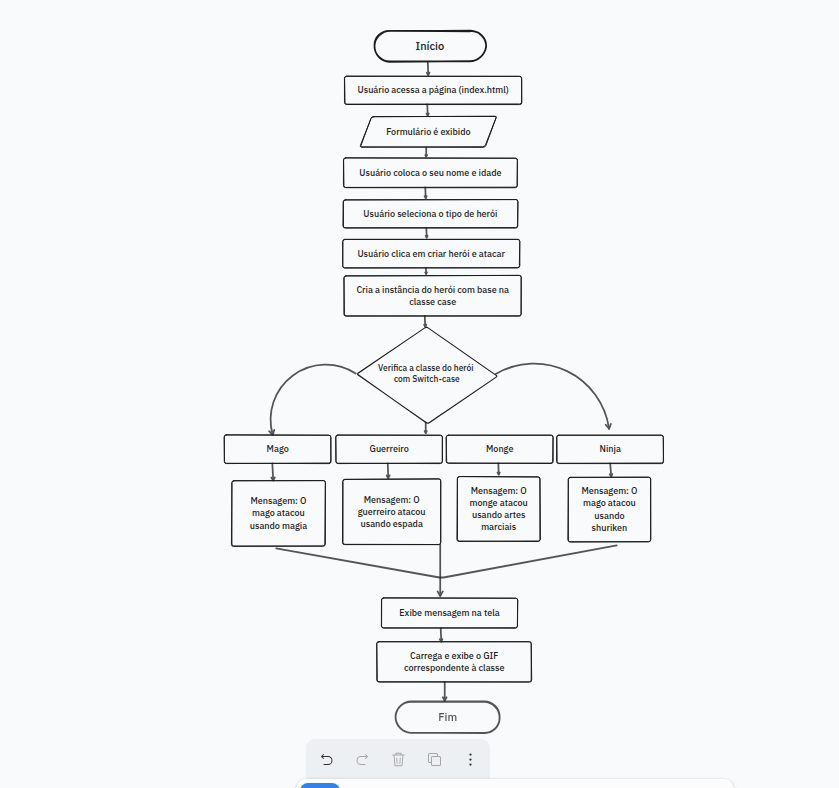

# 🧙‍♂️ Jogo de Herói 
Projeto desenvolvido como parte dos estudos de **Programação Orientada a Objetos (POO)** em JavaScript. Nele, o usuário cria um herói de aventura e vê sua ação personalizada de ataque, com direito a animação (GIF) de acordo com a classe do personagem.

---

## 📋 Descrição do Projeto
Este projeto simula um sistema simples de criação de heróis com diferentes classes: **mago**, **guerreiro**, **monge** e **ninja**. Após preencher o formulário com o nome, idade e tipo do herói, o sistema realiza:

- 🗡️ Uma **mensagem de ataque personalizada** de acordo com a classe.
- 🖼️ Um **GIF animado temático** relacionado ao tipo de herói.
- 💻 Uma **interface moderna**, com imagem de fundo e layout responsivo.

---


## ⚙️ Funcionalidades

- Criação de um herói com:
  - Nome
  - Idade
  - Classe (mago, guerreiro, monge ou ninja)


- Exibição da mensagem:  
  `"O {tipo} atacou usando {ataque}"`

**Exemplos:**  
  - `"O mago atacou usando magia"`  
  - `"O guerreiro atacou usando espada"`

- Exibição dinâmica de um GIF correspondente à classe escolhida.


---

## 🔄 Fluxograma do Projeto

Abaixo está o fluxograma que representa o funcionamento do sistema de criação de heróis:



---


## 📦 Estrutura do Projeto
---
```txt
Jogo-De-Heroi/
├── README.md
├── index.html
├── assets/
│   └── fluxograma.png
└── src/
    ├── css/
    └── js/
```


## 🛠️ Tecnologias Utilizadas

- **HTML5** – Estrutura e marcação da página.
- **CSS3** – Estilização, imagem de fundo e responsividade.
- **JavaScript (ES6+)**  
  - Utilização de **classes e objetos**  
  - Manipulação do DOM e eventos  
  - Estruturas de decisão com `switch`  
  - Exibição dinâmica de conteúdo

---

## 🚀 Como Executar

1. Baixe ou clone este repositório.
2. Abra o arquivo `index.html` em seu navegador.
3. Preencha o formulário com os dados do herói.
4. Clique em "Criar Herói e Atacar".
5. Visualize a mensagem e o GIF do personagem.
   

---

### LINK do projeto: <a href="https://jefersonmanso.github.io/Jogo-De-Heroi/" target="_blank">Acesse o projeto aqui</a>

---

## 💡 Inspiração

Projeto criado com foco no aprendizado prático de JavaScript moderno (ES6+), especialmente no uso de **POO, manipulação de DOM** e construção de interfaces simples.

---

